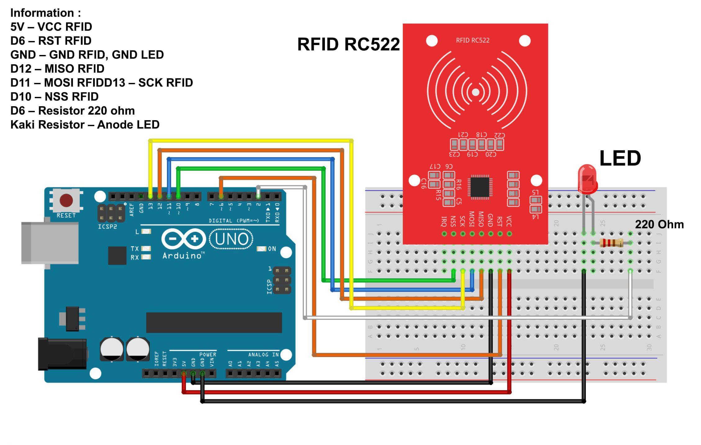

# Lighting-LED-with-RFID-based-on_Arduino-UNO

This project demonstrates how to control an LED using an RFID system and an Arduino. When a recognized RFID tag is scanned, the LED toggles its state between on and off. This system can be used in applications where access control or authentication is needed.

## What is The RFID ?

RFID (Radio Frequency Identification) is a technology that uses radio waves to automatically identify and track objects. It consists of two main components: a tag (attached to the object and stores data) and a reader (which emits radio signals to read the information from the tag). RFID is widely used in applications such as access control, inventory management, logistics tracking, and contactless payments.

The advantages of RFID over other technologies like barcodes include its ability to read information without a direct line of sight between the tag and the reader and its capability to read multiple tags simultaneously.

## Components

- Arduino IDE;
- Library: RFID;
- Arduino Uno = 1 piece;
- RFID Module (RC522) = 1 piece;
- LED (Red or whatever you have) = 1 piece;
- Resistor (220Ω) = piece;
- Project Board / Breadboard = piece;
- Jumper Wires.

## Schematic Picture to Wiring

- Below you can see a schematic image to facilitate the wiring of cables from the microcontroller to devices, both input and output sensors:

## Wiring Information and Tutorial Wiring :

- **RFID Module:**
  - **VCC RFID to Arduino 3.3V or 5V (It's up to you)**
  - **GND RFID to Arduino GND**
  - **NSS (SDA) RFID to Arduino Pin D10**
  - **RST RFID to Arduino Pin D6**
  - **MOSI RFID to Arduino Pin D11**
  - **MISO RFID to Arduino Pin D12**
  - **SCK RFID to Arduino Pin D13**
- **LED:**
  - **Anode (+) to Arduino Pin D2 (through a 220Ω resistor)**
  - **Cathode (-) to Arduino GND**
- **GND:**
  - **GND Arduino, GND RFID, and GND LED --> combined into one**

## Work steps

1. **Prepare the tools and materials to be used.**
2. **Carry out the wiring process using Figure schematic of the above circuit.**
3. **Open the Arduino IDE software that has been installed on laptop/computer.**
4. **Download all the libraries above and insert the library by opening the Arduino IDE, selecting Sketch > Include Library -> Add.Zip Library.**
5. **Type the sketch program on the Arduino IDE page.**
6. **Replace the tag data with the tag you have format:int Data_RFID[4] = {1st_data,th_data2,3rd_data,4th_data};.**
7. **Carry out the program uploading process**

## How It Works

1. **RFID Module:** The RFID reader scans RFID tags and checks if the scanned tag matches a predefined set of values.
2. **LED Control:** If the RFID tag is recognized, the LED toggles its state (ON or OFF). If the tag is not recognized, access is denied, and the LED state remains unchanged.
3. **SPI Communication:** The RFID module communicates with the Arduino via the SPI protocol.

## Code Explanation

- **SPI and RFID Libraries:** The code uses the `SPI` library for communication and the `RFID` library to interact with the RFID module.
- **Tag Matching:** The RFID tag's unique ID is compared with the stored ID in the array `Data_RFID`. If they match, access is granted, and the LED toggles.
- **LED Control Logic:** The LED turns on if it was previously off and vice versa when a recognized tag is scanned.

## Installation

1. **Connect the Components:** Follow the wiring instructions to set up the RFID module and LED.
2. **Upload the Code:** Upload the provided `.ino` file to your Arduino Uno.
3. **Test the System:** Power on the Arduino, scan an RFID tag, and observe the LED's behavior.

## Usage

This project can be used as a simple access control system, where an LED indicator shows whether access has been granted or denied based on the RFID tag.

## Conclusion:

- The program works by detecting tags first, The tag that is first detected by the data reader will be saved, then try bringing the tag closer to the reader then the LED will light up then try it bring different tags closer then the led will not light up.
"# Lighting-LED-with-RFID-base-on-Arduino-Uno" 
